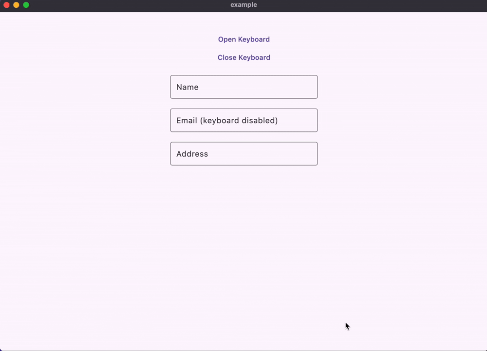

# flutter_onscreen_keyboard

A customizable and extensible on-screen virtual keyboard for Flutter applications. Ideal for desktop and touchscreen environments where physical keyboards are unavailable or limited.

[](https://github.com/albinpk/flutter_onscreen_keyboard/actions/workflows/deploy.yml)
[](https://pub.dev/packages/flutter_onscreen_keyboard)


[](https://github.com/albinpk/flutter_onscreen_keyboard)
[](https://github.com/invertase/melos)

---



## ✨ Features

- 🧩 **Customizable Layouts** – Tailor the keyboard layout and style to suit your UI.
- 🛠️ **Extensible Architecture** – Add custom keys or override behavior easily.
- 💻 **Full Desktop Keyboard** – Complete support for alphabetic, numeric, symbol, and function keys.
- 🔤 **Integrated Text Field** – Comes with a dedicated `OnscreenKeyboardTextField` widget to easily handle user input.
- 🖥️ **Designed for Desktop and Touch Devices** – Ideal for touchscreen setups like POS systems.

---

## 🚀 Getting Started

### 📦 Installation

Add the package to your `pubspec.yaml`:

```yaml
dependencies:
  flutter_onscreen_keyboard: ^0.0.3+1
```

---

## 🧪 Usage

### ➕ Add `OnscreenKeyboard` to Your Root Widget

There are two ways to integrate the keyboard into your root widget:

- Using `OnscreenKeyboard.builder`.

```dart
return MaterialApp(
  builder: OnscreenKeyboard.builder(), // add this line
  home: const HomeScreen(),
);
```

- Using `OnscreenKeyboard.wrap`.

```dart
return MaterialApp(
  builder: (context, child) {
    // your other codes
    // child = OtherWidgets(child: child!);

    // wrap with OnscreenKeyboard.wrap
    return OnscreenKeyboard.wrap(child: child);
  },
  home: const HomeScreen(),
);
```

---

### 🧾 Use `OnscreenKeyboardTextField` Anywhere

You can place the `OnscreenKeyboardTextField` widget anywhere in your app. It will automatically connect with the keyboard and handle input seamlessly.

```dart
@override
Widget build(BuildContext context) {
  return const OnscreenKeyboardTextField(
    // enableOnscreenKeyboard: false, // default to true
  ),
}
```

---

### 🎛️ Access the Keyboard Controller

Use `OnscreenKeyboard.of(context)` to get the keyboard controller instance.

```dart
final keyboardController = OnscreenKeyboard.of(context);
```

---

### 📂 Open and Close the Keyboard Programmatically

With the controller, you can open or close the keyboard as needed in your application flow.

```dart
keyboardController.open(); // open the keyboard

keyboardController.close(); // close the keyboard
```

---

### 🎹 Listen to Key Events

To respond to key presses globally, use the `addRawKeyDownListener` method.

```dart
class _AppState extends State<App> {
  late final keyboard = OnscreenKeyboard.of(context);

  @override
  void initState() {
    super.initState();
    // listener for raw keyboard events
    keyboard.addRawKeyDownListener(_listener);
  }

  @override
  void dispose() {
    keyboard.removeRawKeyDownListener(_listener);
    super.dispose();
  }

  void _listener(OnscreenKeyboardKey key) {
    switch (key) {
      case TextKey(:final primary): // a text key: "a", "b", "4", etc.
        log('key: "$primary"');
      case ActionKey(:final name): // an action key: "shift", "backspace", etc.
        log('action: $name');
    }
  }

  @override
  Widget build(BuildContext context) {
    // ...
  }
}
```

---

## 🎨 Customization

- **Styles:** Customize key colors, shapes, and padding.
- **Layouts:** Switch between full, numeric, or custom layouts (coming soon).
- **Behaviors:** Override key presses and implement custom actions.

```dart
return MaterialApp(
  builder: OnscreenKeyboard.builder(
    theme: const OnscreenKeyboardThemeData(
      textKeyThemeData: TextKeyThemeData(
        decoration: BoxDecoration(
          color: Colors.red,
        ),
      ),
    ),
    // ...more options
  ),
);
```

---

## 📂 Repository

Browse the source code and contribute here:
🔗 [https://github.com/albinpk/flutter_onscreen_keyboard](https://github.com/albinpk/flutter_onscreen_keyboard)

---

## 🛠️ Contributing

Contributions, issues, and feature requests are welcome!
See the [CONTRIBUTING.md](https://github.com/albinpk/flutter_onscreen_keyboard/blob/main/CONTRIBUTING.md) for guidelines.

---

## 📄 License

This project is licensed under the [MIT License](LICENSE).

---

## 🙌 Credits

Created and maintained by [Albin PK](https://github.com/albinpk).
If you find this package useful, consider giving it a ⭐ on GitHub and a like on [pub.dev](https://pub.dev/packages/flutter_onscreen_keyboard)!
